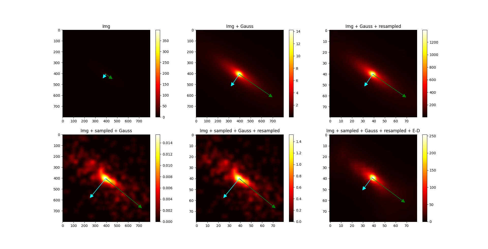

### Source codes for paper:

# Determination of spherical coordinates of sampled cosmic ray flux distribution using Principal Components Analysis and Deep Encoder-Decoder Network

By: Hachaj T, Piekarczyk M, Bibrzycki Ł, Wąs J

Source codes by: [Tomasz Hachaj](https://home.agh.edu.pl/~thachaj/)

Abstract: In this paper we propose a novel algorithm based on the use of Principal 
Components Analysis for the determination of spherical coordinates of sampled cosmic 
ray flux distribution. We have also applied a deep neural network with encoder-decoder
(E-D) architecture in order to filter-off variance noises introduced by sampling. 
We conducted a series of experiments testing the effectiveness of our estimations. 
The training set consisted of 92250 images and validation set of 37800 images. 
We have calculated mean absolute error (MAE) between real values and estimations. 
When E-D is applied cases (estimations) where MAE < 10 increases from 48% to 79% for 
theta and from 62% to 65% for phi, MAE < 5 increases from 24% to 45% for theta and 
from 47% to 52% for phi, MAE < 1 increases from 6% to 9% for theta and from 12% to 16%
for phi. This is a significant change and demonstrates the high utility of the E-D 
network use and about the accuracy of PCA-based algorithm. We also publish the source 
code of our research in ordered to make it reproducible.
## Requirements

Python 3.8, Keras >= 2.8, Tensorflow >= 2.8; numba >= 0.56; scipy >= 1.8; opencv-python >= 4.5

For evaluation visualization in R: dplyr, ggplot2

Tested on: PC, Intel i7-9700 3GHz, 64 GB RAM, NVIDIA GeForce RTX 2060 GPU, Windows 10 OS; 

## How to run

Run file in following order (please update paths according to your system!):

- generate_data_numpy.py
- generate_data_from_numpy.py
- train_network.py

To make visualization of how of our PCA-based + encoder-decoder metod works for selected parameters run script:

- test_method.py
- plots.R

Example results for th=73, ph=145

## Cite as

To be added.